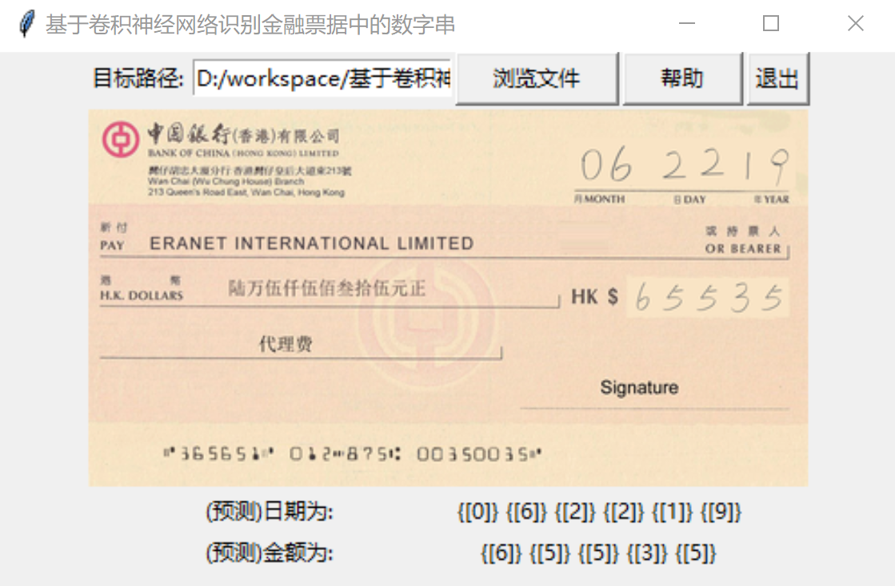

# NumberStringsRecognizerInFinancialBills

**基于卷积神经网络识别金融票据中的手写数字串**

本项目为2019大学生计算机设计大赛参赛项目  待比赛结束后将会把项目完整的释出 敬请期待

___________________________

# 目录

__[作品效果图](#作品效果图)__

__[开发人员名单](#开发人员名单)__

__[作品简介](#作品简介)__

__[作品安装说明](#作品安装说明)__

__[设计方案](#设计方案)__

* 第一部分 - 手写单数字符识别
* 第二部分 - 手写数字串识别
* 第三部分 - 截取金融票据中手写数字所在的位置区域
* 第四部分 – 作品交互性GUI设计
_________________________________

## 作品效果图

图 2-1 运行效果图

由图可见票据的日期为19年06月22日(062219), 程序可以准确的识别; 票据的金额为HK$ 65535, 也能够精准的识别出来, 并显示在图片下方.
作品首先通过”浏览文件”按钮选择扫描获得的金融票据图片, 就能够把金融票据的图片和路径信息显示在屏幕上. 同时通过程序提取出金融票据中的日期, 金额等信息, 并将这些信息显示在图片的下方. 并且, 作品还设置了帮助按键,使用者通过帮助按钮获得帮助.

## 开发人员名单

[DolorHunter](https://github.com/DolorHunter) 

[MarshtompCS](https://github.com/MarshtompCS)

## 作品简介

图 1-1 BARCLAYS支票样例

  - [x] 由图可见金融票据单中有很多的手写数字, 对于这些数字计算机无法直接识别, 只能依靠人工识别输入计算机, 费时费力. 因此我们利用了卷积神经网络技术(CNN)对于手写数字进行神经网络模型训练, 并通过一些预处理操作, 用训练好的模型对预处理后的金融票据中的数字进行识别. 这样就不需要人工识别手写数据, 再输入计算机, 方便高效. 这个技术不仅实用, 更具备一定的商业意义.
  
  - [x] 本作品能够对数字/数字串/金融票据中的数字进行精确识别, 经过nmist测试集测试, 单子符识别正确率为98.08%, 数字串识别正确率为98.08%^n. 不仅如此, 作品的交互性界面设计使其具有极易上手的特点. 作品的可视化程度和交互性使得本作品具备更多的科研和商用意义.

## 作品安装说明

模块和环境:	 Tensorflow 1.0   	 Python 3 		 PIL 		 Numpy 		 Tkinter

帮助: `README`文件和目录说明 和 `README.md`帮助文档

下载命令: 
	
	$ git clone https://github.com/DolorHunter/NumberStringsRecognizerInFinancialBills.git

运行文件: app_gui.exe 即可启动本作品

## 设计方案

金融票据单中有很多的手写数字, 对于这些数字计算机无法直接识别, 只能依靠人工识别费时费力. 因此我们利用了卷积神经网络技术(CNN)对于手写数字进行神经网络模型训练, 并通过一些预处理操作, 用训练好的模型对预处理后的金融票据中的数字进行识别.
 
*为什么要用卷积神经网络(CNN)进行识别呢?*

实际测试中, 经过训练的卷积神经网络对于单个手写数字的识别成功率为98.08%, 对于n位数字串的识别率为98.08%^n. 具备非常高的的精确性和鲁棒性. 而不使用卷积神经网络对于单个手写数字进行识别的成功率仅为14.17%. 虽然有其他客观因素影响结果, 但是可以很清楚的发现使用了卷积神经网络识别技术后, 预测的准确率有了很大的提升.

因此, 我们决定使用卷积神经网络作为作品的神经网络模型.

**作品设计分为四个部分**

`第一部分`是卷积神经网络训练的手写单个数字符识别模型.

`第二部分`是对于手写数字串的反相/去噪声/拆分切片/变形的预处理, 处理后得到多个单数字符传入第一部分.

`第三部分`是对于金融票据中手写数字所在的位置区域进行截取. 截取后把图片传入第二部分.

`第四部分`是对于第三部分的交互性提升. 使用了Tkinter制作了一个GUI. 可以通过GUI的按钮和图片进行可视化的操作.

* A.	第一部分 - 手写单数字符识别

手写单数字符识别的方案参照了主流的神经网络设计八股(准备, 前传, 反传, 迭代)进行总体设计.

通过调用tensorflow的库函数来实现神经网络的参数优化和模型训练以达到识别数字的功能. 我使用mnist数据集对模型参数进行训练. mnist数据集有超过60000个标记样本以供训练. 同时mnist数据集的可靠性也很高, 很适合作为项目的数据集.

神经网络的模型通过喂入mnist数据集中的样本来训练, 通过前向传播和反向传播的计算, 逐渐的修改模型. 其中使用了如: 滑动平均值ema, 正则化损失函数防止过拟合, 指数衰减学习率等高效算法, 让模型修改的更加贴合实际情况.

训练产生的模型将储存于model目录下. 模型实际训练时常约30min, 为方便多次分时训练和后续增加的训练, 因此使用了断点续训的方式.
测试应用的图片文件储存与pic目录, 为手写数字(白底黑字), 用来测试模型的识别的准确性, 也可以根据实际情况上网下载图片进行识别测试.

**通过app_num_ch.py文件调用已经训练好的模型对自定义的单数字符图片进行识别. 经过测试, 识别成功率超过了98.08%, 超过了预期的设计构想. 方案成功.**

* B.	第二部分 - 手写数字串识别
通过对手写数字串进行预处理，使手写数字串转化为多个单数字符。再将单数字符分别传入单数字符识别模型进行计算。

**预处理:**

a)	反相, 去噪声:

预处理中将图片黑白颠倒, 并去除噪声, 故可识别的图片为白底黑字, 符合日常使用需求.

b)	切片:

假定数字串的每个数字之间存在空隙. 图片从左到右逐列识别, 当图片开始出现黑色时, 认为单数字符出现, 标记该列为出现单数字符的列, 并储存; 当图片全列为白 时, 认为单数字符结束, 标记该列为单数字符消失的列, 并储存. 为了便于说明, 将识别黑色(出现)称为黑检测, 将识别白色(结束)称为白检测. 黑白检测通过bool型变量进行切换. 将数字串的个数和位置信息存储于一维数组. 利用一维数组的数据进行中值切片.

图 4-1 为输入的图像(18)(预处理 -切片前)

由图4-1可见图像已经经过了反相/去噪点/变形的步骤, 图片元素只有0和255, 尺寸为28*28. 但由于图像(18)还没有经过切片, 所以图中为多个数字符.(1和8).

图4-2为输入的图像(18)(切片)

由图4-2可见图像经过了切片.原本存在于12-23列的’8’存储为新的图像, 列数改变为1-12.

c)	小图变形:

对于一维数组中的信息进行提取, 将每一个单数字符存储至一个二维数组. 将二维数组变形成2828, 再将二维数组变形成1784的数组, 传入模型进行识别.
小图输入单子符识别模型

d)	输出

输出预测的手写数字串结果. 理论识别率为98.08%^n.

**通过app_num_str.py文件调用对手写数字串进行预处理，使手写数字串转化为多个单数字符。再将单数字符分别传入单数字符识别模型进行计算。用已经训练好的模型对自定义的单数字符图片进行识别. 经过测试, 识别成功率超过了98.08%^n.**

* C.	第三部分 - 截取金融票据中手写数字所在的位置区域

通过对金融票据进行预处理，将手写数字待识别区域截取出来。再将截取出来的部分传入数字串识别模型进行计算。

金融票据固定位置通常会填写固定内容. 因此, 我们可以通过对于某一类的票据设定固定的截取位置就能对这一类票据进行处理. 经过大量测试, 鲁棒性较强.

经过截取, 图片大部分的信息都可以舍弃, 因此可以获得很高的运行效率. 测试图片hk_check.jpg(6.61MB)截取后只剩下两个0.1KB左右的图片. 节省了96.974%的空间. 将这两个0.1KB左右图片输入第二部分的函数, 大大提升了运行速度.

* D.	第四部分 – 作品交互性GUI设计

经过以上三个步骤已经能对于金融票据的图片进行识别了. 但是, 这样的作品不具备交互性和可视化程度, 不能让用户简单容易的使用. 因此, 我们设计了作品的第四部分, 交互性GUI设计.

我们选用了Tkinter作为GUI设计的工具. 经过了几天的学习和设计, 我们做出了具备初步交互性要求的GUI.

GUI首先通过”浏览文件”按钮选择扫描获得的金融票据图片, 就能够把金融票据的图片和路径信息显示在屏幕上. 同时通过程序提取出金融票据中的日期, 金额等信息, 并将这些信息显示在图片的下方. 并且, 作品还设置了帮助按键,使用者通过帮助按钮获得帮助.

通过交互性GUI对于作品进行整合, 不仅增加了交互性, 同时更让作品的推广变得方便起来. 即使第一次使用本作品, 也能迅速上手掌握其操作技巧. 同时, 由于路径和图片的可视化, 让程序的可视化程度达到最大.

**作品的意义不仅仅在于利用预处理的方式省去制作数字串训练集, 整理训练集等的繁琐步骤, 更能通过预处理操作让理论正确率达到98.08%^n. 不仅如此, 作品的交互性设计使其具有极易上手的特点. 作品的可视化程度和交互性使得本作品具备更多的科研和商用意义.**
